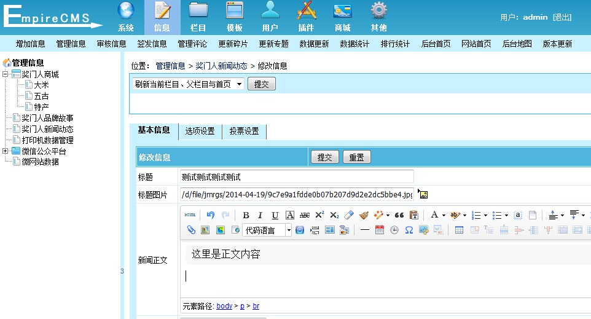
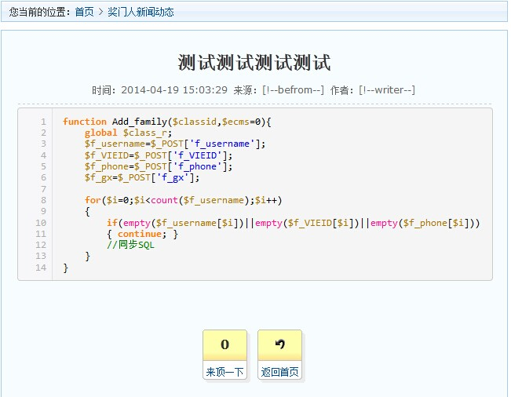

UEditor for ECMS
================

百度编辑器UEditor 1.4.3 深度整合 帝国ECMS7.0 

### 使用说明

- 下载UEditor编辑器 [[下载地址]](http://ueditor.baidu.com/website/download.html "UEditor编辑器下载地址")
- 上传到帝国/e/extend/目录下
- 使用本项目上的controller.php文件，替换编辑器自带的PHP文件（目录/e/extend/ueditor/php/controller.php）
- 修改帝国CMS字段HTML，替换为以下代码 [[字段管理方法]](http://www.phome.net/doc/manual/mod/html/field.html "帝国CMS字段管理方法")
```php
<?php if(!isset($Field)){ ?>
<script type="text/javascript" src="/e/extend/ueditor/ueditor.config.js"></script>
<script type="text/javascript" src="/e/extend/ueditor/ueditor.all.js"></script>
<?php } ?>
<?php
/**
 * ECMS UEditor编辑器字段配置
 * User: pkkgu 910111100@qq.com
 */
$Field    = 'newstext'; //*字段名称
$FieldVal = $ecmsfirstpost==1?"":stripSlashes($r[$Field]);
$isadmin  = 0;
if($enews=='AddNews'||$enews=='EditNews')
{ $isadmin=1; }
else
{ $FieldVal  = empty($ecmsfirstpost)?DoReqValue($mid,$Field,$FieldVal):$r[$Field]; }
?>
<script id="<?=$Field?>" name="<?=$Field?>" type="text/plain"><?=$FieldVal?></script>
<script type="text/javascript">
var ue = UE.getEditor('<?=$Field?>',{
	pageBreakTag:'[!--empirenews.page--]' //分页符
	, serverUrl: "/e/extend/ueditor/php/controller.php?isadmin=<?=$isadmin?>"
	//,toolbars:[['FullScreen', 'Source', 'Undo', 'Redo','Bold']] //选择自己需要的工具按钮名称
});
ue.ready(function(){
	ue.execCommand('serverparam', {
		'classid' : '<?=$classid?>',
		'filepass': '<?=$filepass?>',
		'userid'  : '<?=$isadmin?$logininid:$muserid?>',
		'username': '<?=$isadmin?$loginin:$musername?>',
		'rnd'     : '<?=$isadmin?$loginrnd:$mrnd?>'
	});
});
</script>
```


#编辑内容展示
- 修改内容模板加入下面代码（注意：#text为内容容器ID）
```javascript
<script src="/e/extend/ueditor/ueditor.parse.min.js"></script>
<script>uParse('#text', {rootPath: '/e/extend/ueditor/'})</script>
```


### 说明
- controller.php 后端处理文件
- Field_html.php 帝国CMS字段HTML
- GBK版本需要服务器支持iconv函数
- 附件地址目录已经整合帝国系统的配置